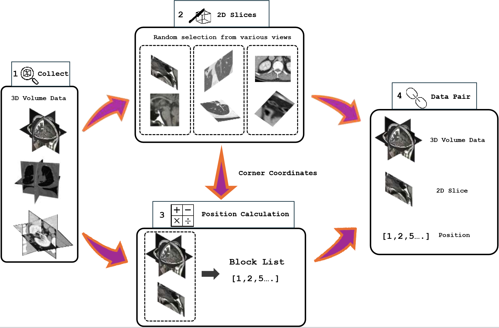

# ATOM: align tissue plane back to organ volume dataset
This is ATOM dataset with RegisMCAN code. ATOM is the first dataset for the tissue-organ registration problem.


## Data
Before running, you should first download the data from https://drive.google.com/drive/folders/1QeW3oO09tKILnoNskrBL3dnvJgKQsQSb?usp=drive_link. This will help you to get a folder called data_pkl. And you should put it in the same folder as the code. (Same file hierarchy as train.py)

Also, please check the Medmnist (https://medmnist.com/) and ADNI (https://adni.loni.usc.edu/) datasets and download them. If you cannot find how to download ADNI, please email Yifeng (yifengw3@andrew.cmu.edu) for help.

## Prerequisites
- numpy            
- pytorch          2.0.1+cu117
- medmnist
- dill
- scipy            1.7.1
- tqdm             4.62.3

## Running
Then you can run the code with Python:
```
  python train.py
```

